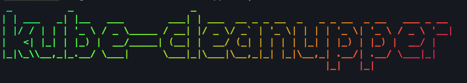

# kube-cleanupper



## Kube-cleanupper ( Kubernetes cleanup service )

kube-cleanupper is a kubernetes helper service which will scout throught out your cluster and clean up the objects which are maked to be deleted withtin the given period of time. 


## Current Features

1. Easy Label based object selection for deletion without any hassel.
2. Easy Object deletion based on their age and defined retention period.
3. CLI as well ad can run scheduled kubernetes CronJob.
2. Easy allocation of retention period. Just define labels while creating manifests file.
4. Currently, kube-cleanupper looks only for retention period in days. We will be adding feature to look for rentention period in weeks, months and years in future.
5. By default, kube-cleanupper would look for objects older then 4 days and delete them. If you want to change that value, you can specify via command line, or update the k8s manifest file .
6. Disable auto deletion using `auto-clean=disabled`. And kube-cleanupper would not touch that object.

## Requirements

Kube-cleanupper works on label based selection of resource to purge hence, kube-cleanupper will only look for k8s objects which has following labels applied to it.

```
auto-clean=enabled
retention=4d
``` 

`auto-clean=enabled` label needs to be applied to namespace. This is how kube-cleanupper will know if it has to look into that namespace or not. This can be done manually or through manifests file. This can be done using following methods.


Applying label to namespace via CLI


```
    kubectl label namespace <namespace> auto-clean=enabled
```


Applying label to namespace via manifest


```
    apiVersion: v1
    kind: Namespace
    metadata:
      name: <NAMESPACE>
      labels:
        auto-clean: enabled
        retention: 4d
```

`auto-clean=enabled` and `retention=4d` labels must be applied to all k8s objects which you want to be auto managed / cleanedup using kube-cleanupper. This can be done using following methods.


Applying label to k8s objects using command line:


    ```
    kubectl label deployment <deployment> auto-clean=enabled retention=4d
    ```
    

    Applying label to k8s objects using manifest:


    ```
      labels:
        auto-clean: enabled
        retention: 4d
    ```
    
## Caution

Be aware that kube-cleanupper is a very destructive tool, hence you need to be very careful when using it. Usage without proper understaning of tool might cause deletion of production data. Do not use kube-cleanupper to manage production namespace.

## Usage

```
Usage: kube-cleanupper [-d <no_of_days>] 

Options:
                    -h                     Display this help message.
                    -d <no_of_days>        Deletes all kubernetes objects with labels auto-clean=enabled and age over given retention period.
                    -f                                                                                                                                                 
```

## Usage via cli

NOTE: For this you would need to have kubeconfig setup on your local workstation.

```bash
git clone https://github.com/pgaijin66/kube-cleanupper.git
cd kube-cleanupper
bash kube-cleanupper -d 4
```

## Usage via container

NOTE: For this to work, you should have kubeconfig of the service account, or admin kubeconfig mounted to the container.

Build image first
```bash
docker build -t kube-cleanupper:latest .
```

Run using the image created
```
docker run -it --rm  --mount type=bind,src=<path/to/kubeconfig>,dst=/root/.kube --name demo kube-cleanupper:latest -d 4
```

## Run as Kubernetes Cronjob

To run kube-cleanupper as a scheduled k8s cronjob go to the kubernetes manifest file inside `kubernetes` folder, Modify the days you would want to check before deleting.

This will check the all the labeled objects age and try to see if they are older than our given day to retain.
```
 ...
 ...
            args: ["-d", "1"] <==== 1 for 1 day, 4 for 4 days, 10 for 10 days
...
...
```

Apply the kubernetes configuration.
```bash
kubectl apply -f kubernetes/
```

This would create namespace, serviceaccount, clusterRole, apply clusterRoleBinding and create cronjob.

```
namespace/kube-cleanupper unchanged
serviceaccount/kube-cleanupper unchanged
clusterrole.rbac.authorization.k8s.io/kube-cleanupper unchanged
clusterrolebinding.rbac.authorization.k8s.io/kube-cleanupper-crb unchanged
cronjob.batch/kube-cleanupper unchanged
```

# Contributing guidelines

Before you make your changes, check if the issue already exists for the change you want to make.

### Don't see your issues ?

If you do not find the issue that you are facing and want to open a new issue please use the following template.

### Are you ready to make a change ?

If you have reporeted the issue has the moderator has allowed the proposed change to be implemented, fork the repo using Github. 

### Make your change

Once you forked the repo, make changes as you feel or you would like to update. 

### Open a pull request

When you are done making changes and you would like them for review, please use the PR template to open your PR.

### Submit PR and get it review

Submit your PR and wait for the moderator to review it with you. Please check back on PR to keep up with the conversations from the maintainers. 

### Merge your PR

Once your PR has been approved,  moderator would give that PR a final review and will be scheduled to be merged to the main branch. Thank you for your support.